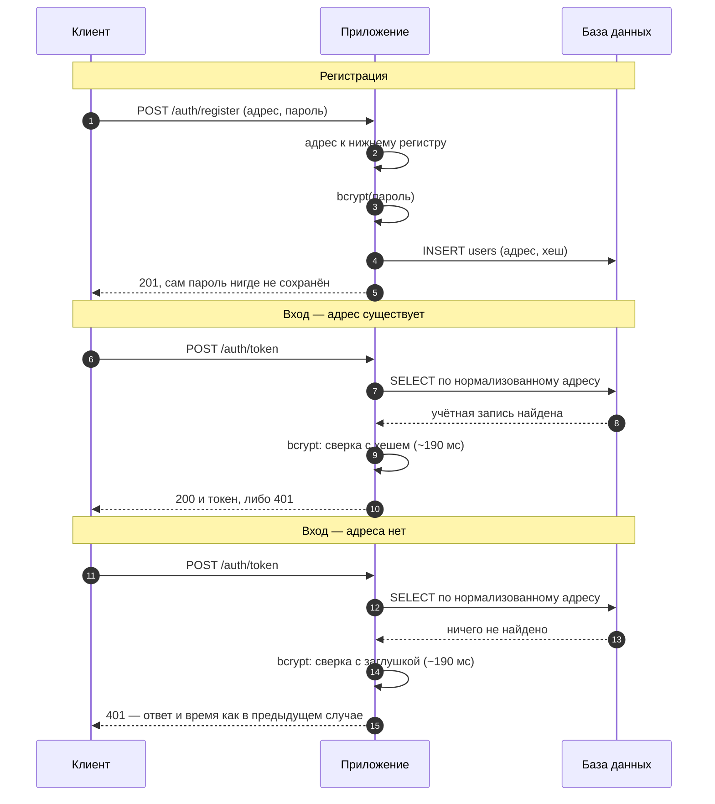
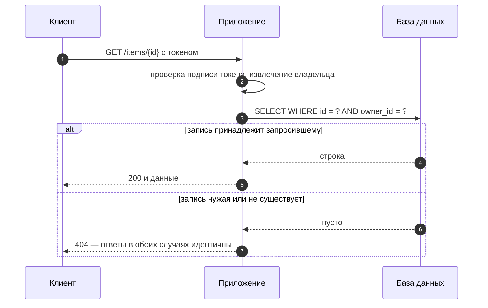

# Архитектура

Описание построено по модели C4. Диаграммы хранятся текстом (Mermaid) рядом с кодом: картинка расходится с системой молча, текст виден в изменении.

| Уровень | Документ | Отвечает на вопрос |
|---|---|---|
| 1. Контекст | [docs/architecture/context.md](docs/architecture/context.md) | кто пользуется системой и от чего она зависит |
| 2. Контейнеры | [docs/architecture/containers.md](docs/architecture/containers.md) | что разворачивать и что с чем разговаривает |
| 3. Компоненты | не рисуется | устройство линейное, схема повторила бы таблицу слоёв |
| 4. Код | не рисуется никогда | выводится из кода и устаревает в день создания |

Ниже — то, что диаграммами не передаётся: ответственность слоёв и поведение во времени.

## Слои и ответственность

| Слой | Файл | Отвечает за |
|---|---|---|
| Точка входа | `app/main.py` | Сборка приложения, middleware, логирование, роутеры |
| Конфигурация | `app/config.py` | Настройки из окружения, проверки безопасности при старте |
| Транспорт | `app/routers/*` | HTTP-эндпоинты, коды ответов |
| Контракты | `app/schemas.py` | Валидация входа, форма ответа |
| Доступ | `app/deps.py` | Текущий пользователь, сессия БД |
| Данные | `app/models.py`, `app/db.py` | Модели, подключение, сессии |
| Безопасность | `app/security.py` | Хеширование паролей, выпуск и проверка JWT |

Границы между слоями держатся на двух правилах:

1. **Роутер не работает с БД напрямую** — только через сессию из зависимости.
2. **Модель не покидает приложение** — наружу уходит схема, где перечислены
   конкретные поля. Это структурная защита от утечки: чтобы хеш пароля попал
   в ответ, кто-то должен осознанно добавить его в схему.

## Поток аутентификации

Диаграмма последовательности показывает то, чего не показывает C4, — поведение во времени. Здесь это существенно: два пути входа намеренно сделаны неразличимыми не только по ответу, но и по длительности.

**Почему сверка выполняется даже тогда, когда пользователя нет.** Без неё ответ возвращался бы мгновенно, а для существующего адреса тратилось бы время bcrypt. Замер до исправления: 195 мс против 3 мс при непересекающихся диапазонах — то есть по времени ответа можно было безошибочно определить, зарегистрирован ли адрес. Подробности в [отчёте о приёмке](docs/AUDIT-2026-09-03.md).

Заглушка вычисляется при старте приложения: иначе первый запрос с незнакомым адресом отработал бы вдвое дольше и снова выделялся.

## Доступ к данным

Ключевая деталь: фильтр по владельцу стоит **в самом запросе к базе**. Записи чужого пользователя не выбираются вообще, поэтому ошибка в коде выше по стеку не может привести к их выдаче.

Ответ 404, а не 403, — тоже намеренно: 403 подтвердил бы, что запись с таким идентификатором существует.

## Проверки состояния

| Эндпоинт | Назначение | Поведение при отказе БД |
|---|---|---|
| `/health/live` | Процесс жив | 200 (БД не проверяется) |
| `/health/ready` | Готов принимать трафик | 503 + `database: unavailable` |

Разделение намеренное: при недоступности БД контейнер **не должен**
перезапускаться (это не поможет), но и трафик на него слать не нужно.

## Наблюдаемость

- Логи в JSON — пригодны для сбора в любой системе агрегации.
- Каждый ответ содержит `X-Request-ID`; если клиент прислал свой — он сохраняется.
- В логе фиксируется метод, путь, код ответа и время обработки.

## Что осознанно НЕ включено

Шаблон намеренно не тащит за собой то, что нужно не всем. См. [docs/TECH_DEBT.md](docs/TECH_DEBT.md)
— там перечислено, что и при каких условиях стоит добавить.
