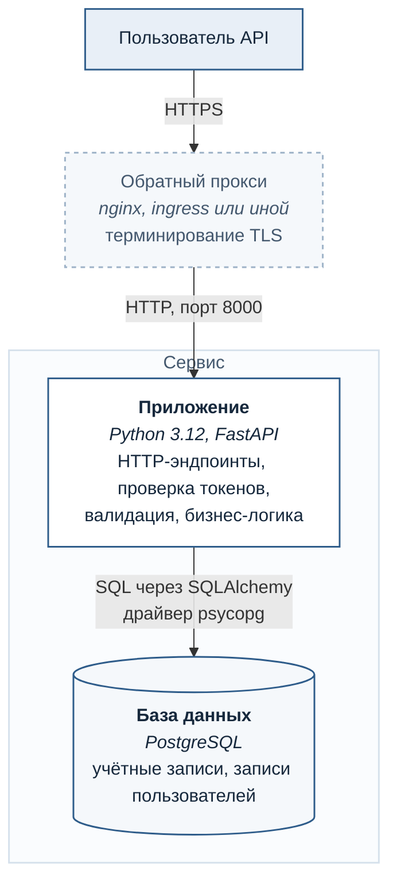

# Контейнеры

Уровень 2 модели C4: из чего система состоит и на чём написана. Отвечает на вопрос «что разворачивать и что с чем разговаривает».

Прокси показан пунктиром: он не входит в поставку шаблона, но без него систему нельзя выставлять наружу — шифрование канала обеспечивает именно он.

## Что внутри приложения

Компонентная диаграмма (уровень 3) для этого сервиса не рисуется: устройство линейное, и схема повторила бы таблицу ниже, не добавив ничего. Компонентный уровень оправдан там, где внутри контейнера есть нетривиальные связи.

| Слой | Файлы | Отвечает за |
|---|---|---|
| Точка входа | `app/main.py` | сборка приложения, промежуточные обработчики, логирование |
| Конфигурация | `app/config.py` | настройки из окружения, проверки при старте |
| Транспорт | `app/routers/` | HTTP-эндпоинты и коды ответов |
| Контракты | `app/schemas.py` | проверка входа, состав ответа |
| Доступ | `app/deps.py` | текущий пользователь, сессия БД |
| Данные | `app/models.py`, `app/db.py` | модели, подключение |
| Безопасность | `app/security.py` | хеширование паролей, выпуск и проверка токенов |

Границы держатся на двух правилах: обработчик не обращается к базе напрямую, только через сессию из зависимости; модель базы не покидает приложение — наружу уходит схема с перечисленными полями.

Второе правило — структурная защита, а не договорённость: чтобы хеш пароля попал в ответ, кто-то должен осознанно добавить его в схему.

## Развёртывание

| Что | Как |
|---|---|
| Приложение | контейнер, многоэтапная сборка, процесс не от привилегированного пользователя |
| Порт | 8000, наружу выставляется через прокси |
| Проверка живости | `/health/live` — процесс жив, база не проверяется |
| Проверка готовности | `/health/ready` — при недоступности базы отвечает 503 |
| Секреты | только через переменные окружения |

Разделение проверок намеренное: при недоступности базы контейнер перезапускать бессмысленно, но и трафик на него направлять не нужно.
