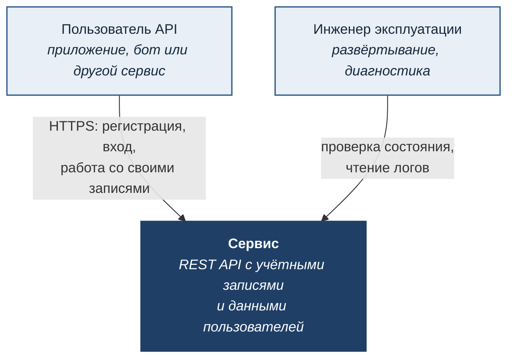

# Контекст системы

Уровень 1 модели C4: что система делает и с чем связана. Отвечает на вопрос «кто ею пользуется и от чего она зависит».

## Границы

**Входит в систему:** аутентификация по паролю, выпуск и проверка токенов доступа, хранение записей пользователей с разграничением доступа по владельцу.

**Не входит:** доставка почты, платежи, файловое хранилище, внешние справочники. Шаблон намеренно не тянет за собой интеграции, которые нужны не всем, — см. [реестр ограничений](../TECH_DEBT.md).

**Шифрование канала** обеспечивается прокси перед приложением, а не самим приложением. Это осознанное решение: терминирование TLS — ответственность инфраструктуры.

## Кто и что может

| Участник | Доступ |
|---|---|
| Неаутентифицированный | регистрация, вход, проверка живости |
| Аутентифицированный | чтение и изменение **только своих** записей |
| Инженер эксплуатации | состояние сервиса, логи; доступа к данным пользователей через API нет |

Ролевой модели внутри аутентифицированных пользователей нет — все равны, разграничение идёт только по владению записями. Условия, при которых её стоит добавить, описаны в [реестре ограничений](../TECH_DEBT.md).
